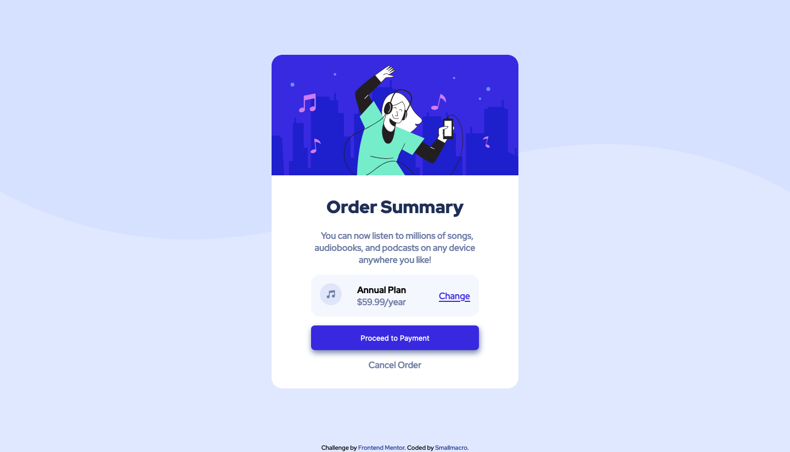
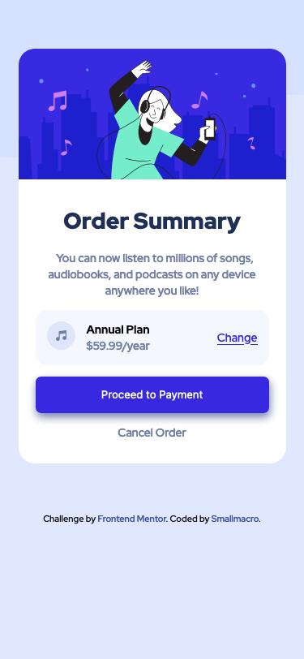

# Frontend Mentor - Order summary card solution

This is a solution to the [Order summary card challenge on Frontend Mentor](https://www.frontendmentor.io/challenges/order-summary-component-QlPmajDUj). Frontend Mentor challenges help you improve your coding skills by building realistic projects. 

## Table of contents

- [Overview](#overview)
  - [The challenge](#the-challenge)
  - [Screenshot](#screenshot)
  - [Links](#links)
- [My process](#my-process)
  - [Built with](#built-with)
  - [What I learned](#what-i-learned)
  - [Continued development](#continued-development)
  - [Useful resources](#useful-resources)
- [Author](#author)
- [Acknowledgments](#acknowledgments)


## Overview

### The challenge

Users should be able to:

- See hover states for interactive elements

### Screenshot





### Links

- Solution URL: [Github repository](https://github.com/smallmacro/challenge1)
- Live Site URL: [Netlify URL](https://kind-curie-a68563.netlify.app)

## My process

### Built with

- Semantic HTML5 markup
- Flexbox
- Google Font


### What I learned

1. Customize and use cdn files of Google Fonts from guide.

2. Multiple background and the usage of `background-size:contain` property.


```css
body{
    background: url('../images/pattern-background-desktop.svg') no-repeat;
    background-color: hsl(225, 100%, 94%);
}
@media screen and (max-width:480px) {
    body{
        background: url('../images/pattern-background-mobile.svg') no-repeat;
        background-size: contain;
    }
```
3. Learned how to deploy the webpages to `Netlify`.

### Continued development

I think much detail in Sketch or Figma files is needed. 

Maybe I should try to use mobile-first workflow. 

### Useful resources

- [Google fonts](https://fonts.google.com/) - A Good resource.

## Author


- Frontend Mentor - [@smallmacro](https://www.frontendmentor.io/profile/smallmacro)

## Acknowledgments
