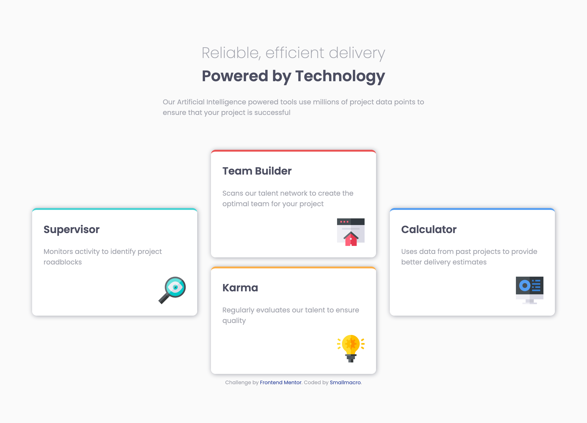
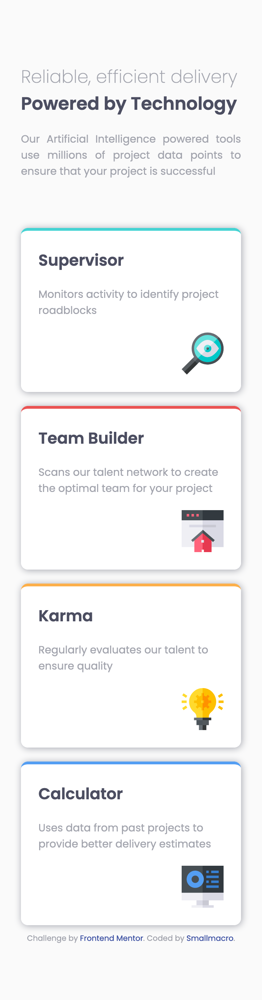

# Frontend Mentor - Four card feature section solution

This is a solution to the [Four card feature section challenge on Frontend Mentor](https://www.frontendmentor.io/challenges/four-card-feature-section-weK1eFYK). Frontend Mentor challenges help you improve your coding skills by building realistic projects. 

## Table of contents

- [Overview](#overview)
  - [The challenge](#the-challenge)
  - [Screenshot](#screenshot)
  - [Links](#links)
- [My process](#my-process)
  - [Built with](#built-with)
  - [What I learned](#what-i-learned)
  - [Continued development](#continued-development)
  - [Useful resources](#useful-resources)
- [Author](#author)
- [Acknowledgments](#acknowledgments)

## Overview

### The challenge

Users should be able to:

- View the optimal layout for the site depending on their device's screen size

### Screenshot

### Links

- Solution URL: [Github repositery](https://github.com/smallmacro/challenge2)
- Live Site URL: [Netlify URl](https://xenodochial-mestorf-3c034f.netlify.app)

## My process

### Built with

- Semantic HTML5 markup
- CSS custom properties(Css Variables)
- Google Fonts
- Flexbox
- CSS Grid
- Mobile-first workflow

### What I learned

In this simple webpage, I used Mobile-first workflow and it seems to work well.

### Continued development

This page is so simple, maybe it needs some interactive effect.
The box-shadow used in these grid cards seems a little different from design. It can be solved by accessing the original sketch or figma files.

### Useful resources

- [The State Of Mobile First and Desktop First](https://ishadeed.com/article/the-state-of-mobile-first-and-desktop-first/) - This article helps me figure out  how to make decision between the Moble-first and PC first workflow.

## Author

- Frontend Mentor - [@yourusername](https://www.frontendmentor.io/profile/smallmacro)

## Acknowledgments

