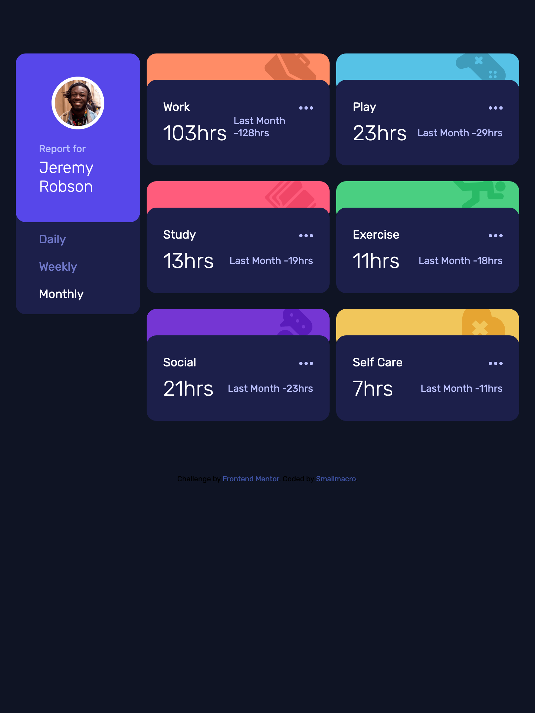

# Frontend Mentor - Time tracking dashboard solution

This is a solution to the [Time tracking dashboard challenge on Frontend Mentor](https://www.frontendmentor.io/challenges/time-tracking-dashboard-UIQ7167Jw). 

## Table of contents

- [Overview](#overview)
  - [The challenge](#the-challenge)
  - [Screenshot](#screenshot)
  - [Links](#links)
- [My process](#my-process)
  - [Built with](#built-with)
  - [What I learned](#what-i-learned)
  - [Continued development](#continued-development)
  - [Useful resources](#useful-resources)
- [Author](#author)
- [Acknowledgments](#acknowledgments)

## Overview

### The challenge

Users should be able to:

- View the optimal layout for the site depending on their device's screen size
- See hover states for all interactive elements on the page
- Switch between viewing Daily, Weekly, and Monthly stats

- customize a layout for tablet(640px~900px)
- Load the json data file into UI

### Screenshot

### Links

- Solution URL: [Add solution URL here](https://your-solution-url.com)
- Live Site URL: [Add live site URL here](https://your-live-site-url.com)

## My process

### Built with

- Semantic HTML5 markup
- CSS custom properties
- Flexbox
- Mobile-first workflow
- basic ES6 

### What I learned
1. Safely munipulate the DOM by listening to the `DOMContenLoaded` event.

2. Complete the basic ES6 syntax learning and use the `let` and  `arrow function`

3. Load the json data through `fetch` function.

4. Mobile-first flow works well since there are many similarities among the mobile, tablet(customized by myself) and desktop design.

### Continued development
If considered the performance of the loading page, is there something needed to be improved?

### Useful resources

- [LICEcap](https://www.cockos.com/licecap/) - Great and simple screen recording app, really recommand it.

## Author

- [@smallmacro](https://github.com/smallmacro)

## Acknowledgments
- [Frontend Mentor](https://www.frontendmentor.io/)
