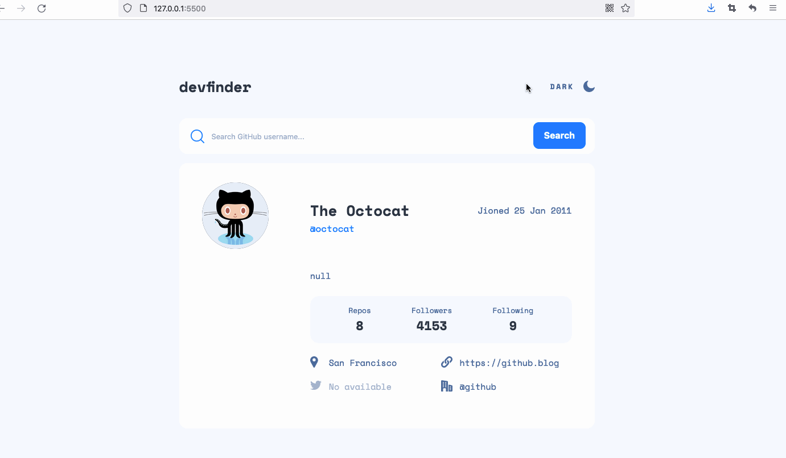

# Frontend Mentor - GitHub user search app solution

This is a solution to the [GitHub user search app challenge on Frontend Mentor](https://www.frontendmentor.io/challenges/github-user-search-app-Q09YOgaH6). Frontend Mentor challenges help you improve your coding skills by building realistic projects. 

## Table of contents

- [Overview](#overview)
  - [The challenge](#the-challenge)
  - [Screenshot](#screenshot)
  - [Links](#links)
- [My process](#my-process)
  - [Built with](#built-with)
  - [What I learned](#what-i-learned)
  - [Continued development](#continued-development)
  - [Useful resources](#useful-resources)
- [Author](#author)
- [Acknowledgments](#acknowledgments)


## Overview

### The challenge

Users should be able to:

- View the optimal layout for the app depending on their device's screen size
- See hover states for all interactive elements on the page
- Search for GitHub users by their username
- See relevant user information based on their search
- Switch between light and dark themes

- **Bonus**: Have the correct color scheme chosen for them based on their computer preferences. _Hint_: Research `prefers-color-scheme` in CSS.

### Screenshot




### Links


- Solution URL: [Github repository](https://github.com/smallmacro/smallmacro.github.io/tree/main/challenge4)

- Live Site URL: [Github Pages URL](https://smallmacro.github.io/challenge4/)


## My process

### Built with

- Semantic HTML5 markup
- CSS custom properties
- Flexbox
- CSS Grid
- Mobile-first workflow
- ES6. Destructing assightment and Promise function
### What I learned

1. Use the custom css variables to define the dark and light theme. And munipulate these variables by javascript:
```javascript
//To Get property value
 getComputedStyle(document.documentElement)
    .getPropertyValue('--my-variable-name')

// To set property:
 document.documentElement.style
    .setProperty('--my-variable-name', value);
```

2. This is a mobile-first work flow. And I set the third breakpoint to 70em(1120px), the reason why I do this is the main content in visual design is `730px` width, it means large desktop device less than 1440px(between `48em` to `70em`) may look well, SO I change the body padding and set header and setion to center with a `min-width` to `730px` and a `width` to `50.694vw`;  But in this case, what would be the best practice to deal with.()


3. Parse a string to datetime format.
```javascript
const date = new Date(2019, 0, 23, 17, 23, 42);
date.toString() //gives you Wed Jan 23 2019 17:23:42 GMT+0800 (Singapore Standard Time)
date.toDateString() // gives you Wed Jan 23 2019
date.toLocaleString() // gives you 23/01/2019, 17:23:42
date.toLocaleDateString() // gives you 23/01/2019
date.toGMTString() // gives you Wed, 23 Jan 2019 09:23:42 GMT
date.toUTCString()// gives you Wed, 23 Jan 2019 09:23:42 GMT
date.toISOString()// gives you 2019-01-23T09:23:42.079Z
```

4. Handling the http status code and defining specfic behavour are big challenges. By constructing new Promise with `resolve` parameter, `respone.ok`  and `respone.status` can delivered through this function.:

```javascript
// handle the http status

    fetch(url).then(response => {
            return new Promise((resolve) => response.json()
            .then((json) => resolve({
                status: response.status,
                ok: response.ok,
                json,
            })))
        }).then(({status, json, ok}) => {
            //do something here
            
        }).catch(error => {
            console.log(error);
        });

```

5. The given api return the json object with redundant data.And destructuring assightment as function parameter is really powerful.It allows me just grap the necessary key values.

```javascript
const updateUI = ({login,
                    avatar_url,
                    name,
                    company,
                    blog,
                    location,
                    bio ,
                    twitter_username ,
                    public_repos,
                    followers ,
                    following,
                    created_at},
                    userEle,infoEle) => {

                   //do something here   
}

```

6. chorme has its own input autofill style. Below css code sovles part issue.
```css
input:-webkit-autofill,
input:-webkit-autofill:hover, 
input:-webkit-autofill:focus {
    background-color: var(--theme-main-bg-color) !important;
    font-family: inherit;
    color: var(--theme-font-color);
    box-shadow: 0 0 0px 1000px var(--theme-main-bg-color) inset;
    transition: background-color 5000s ease-in-out 0s;
}
```
### Continued development
Test and review the code to find bugs.


### Useful resources

- The GitHub users API endpoint is `https://api.github.com/users/:username`. So, if you wanted to search for the Octocat profile, you'd be able to make a request to `https://api.github.com/users/octocat`.

-  - The prefers-color-scheme CSS media feature is used to detect if the user has requested a light or dark color theme.

- This article
really helps about  how to munipulate css variables when switching themes.

-  This question inspires me to construct a new Promise and sent json data along with `respone.status` and `respone.ok`. This enables me to munipulate the UI and update the data based on `respone.status` and `respone.ok`.

## Author

- [@smallmacro](https://github.com/smallmacro)


## Acknowledgments
- [Frontend Mentor](https://www.frontendmentor.io/)
